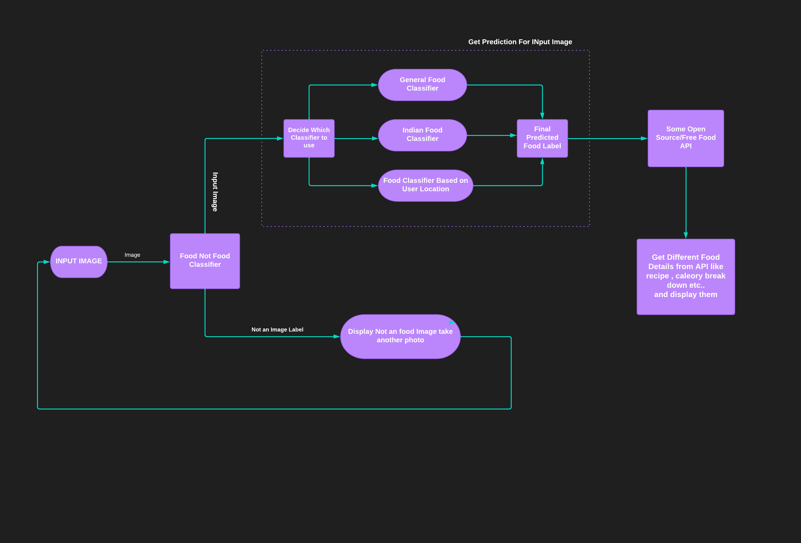
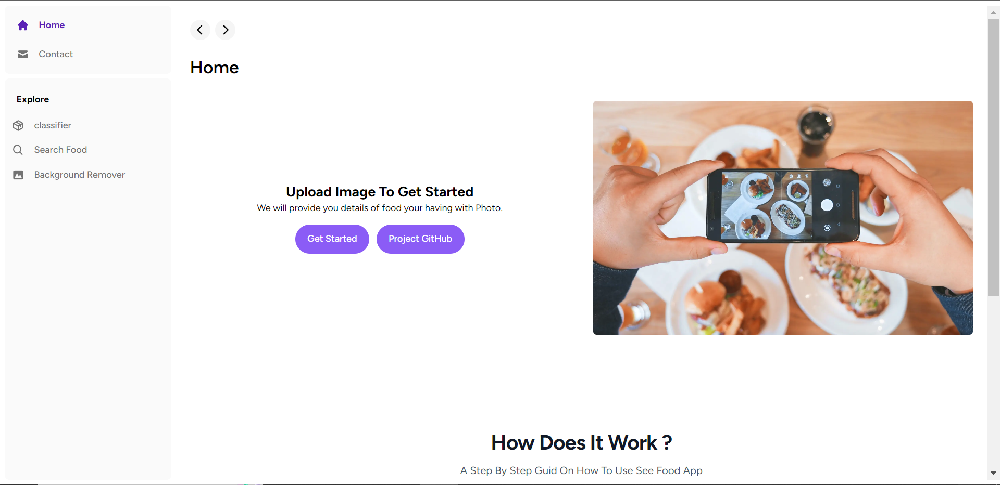
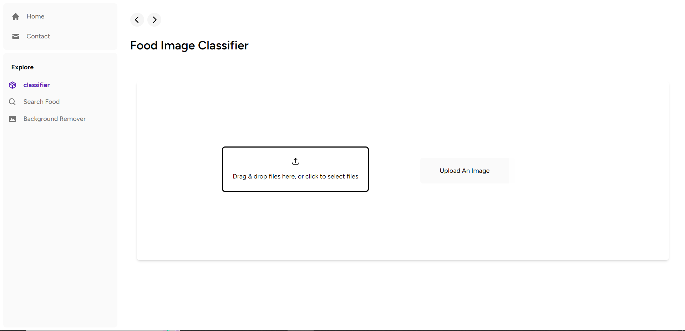
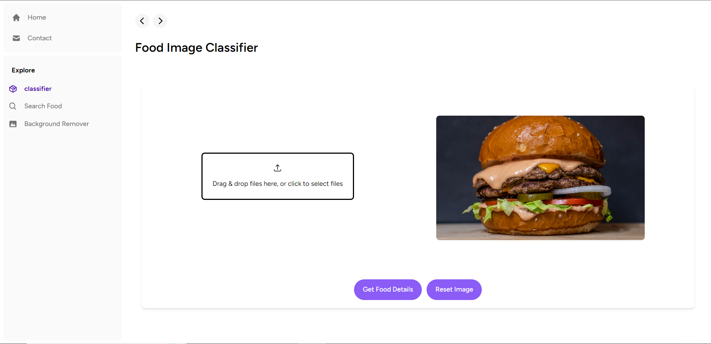
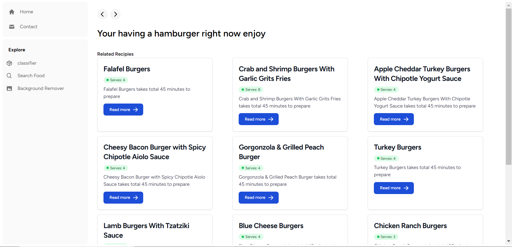
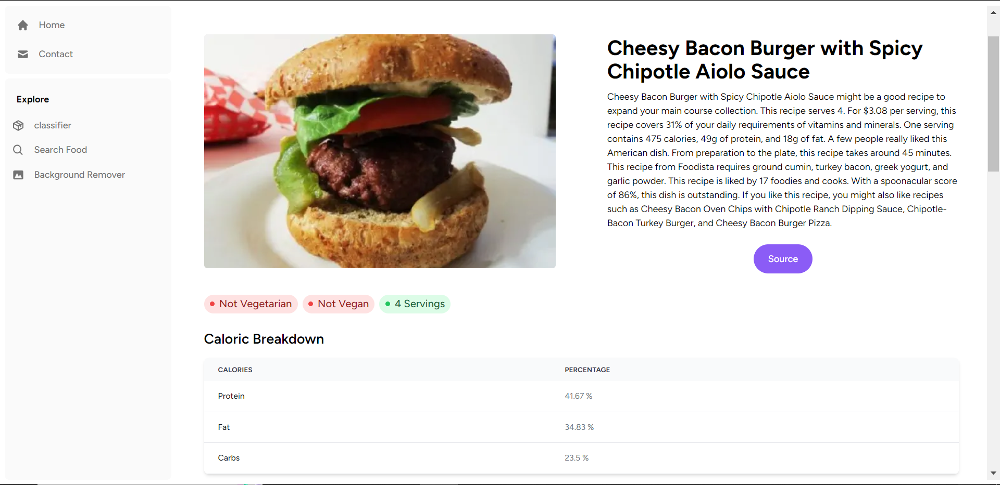
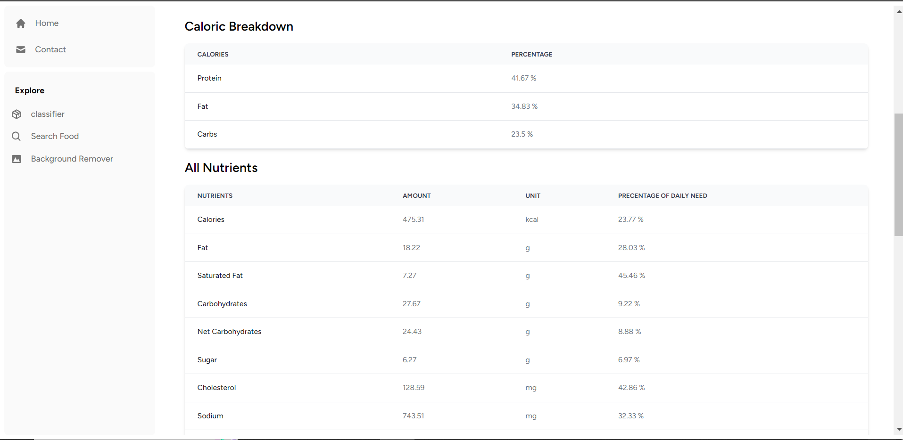
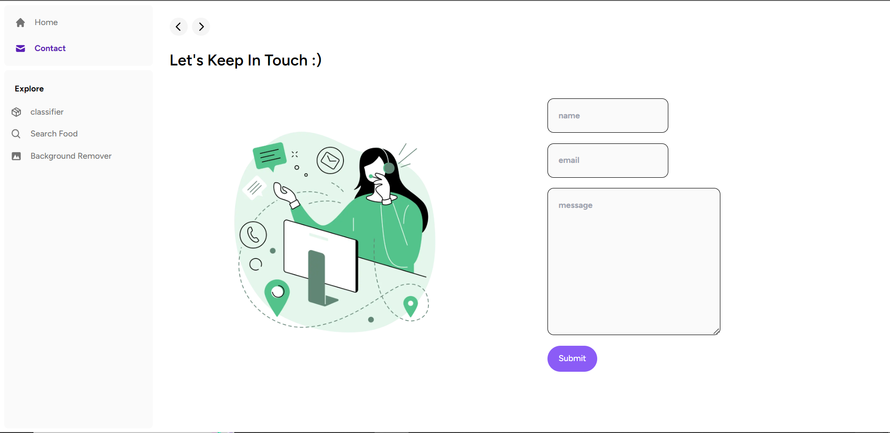

# SeeFood Website
SeeFood is an website with image classification model which classifies uploaded food image and then displaces similara dishes, theri recipies and caloric breackdowns

**More details about ML model and project workflow is [available hear](https://github.com/vishalrk1/SeeFood)**

- **NextJS Frontend code is availabel in [frontend folder](https://github.com/vishalrk1/SeeFood-Website/tree/master/frontend)**
- **Django REST api code for image classification is available in [backend folder](https://github.com/vishalrk1/SeeFood-Website/tree/master/backend)**

## Tech Stack
- Next JS 13
- React JS
- Django rest framework
- tailwind CSS
- pytorch
- python
- Javascript

## Project Flow Chart

</img>

## Website Screenshots

## Contact Me

    <a href="https://github.com/vishalrk1" target="_blank">
        &nbsp;
    </a>
    <a href="https://www.linkedin.com/in/vishal-karangale-126492216/" target="_blank">
        &nbsp;
    </a>
     <a href="https://www.instagram.com/vishal_rk1/" target="_blank">
       &nbsp;
    </a>

